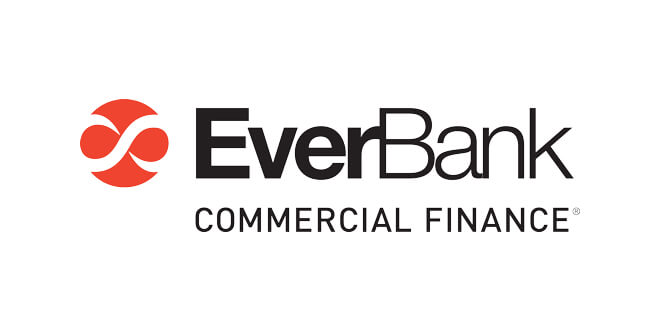

# ECF
## IT Dashboard Developer Internship
###### James McElduff
###### Summer 2017

#### Tasklist
- [ ] Qlikview to Qliksense migration
  - [x] Rate Plan Surveillance
  - [x] Support Center
  - [x] Support Center QVD Generator
  - [ ] Home Lending Ops
  - [ ] Home Lending Ops QVD Generator Part 1
  - [ ] Home Lending Ops QVD Generator Part 2
  - [ ] Home Lending Sales
  - [ ] Action Resolution Tracking
- [ ] New dashboards for Qliksense
- [ ] Documentation for Qlik Knowledge Base
- [ ] Visual enhancements
- [ ] Improve existing dashboards

#### Knowledge List
- [ ] HTML, Javascript, CSS
- [x] SQL/T-SQL
- [ ] Markdown
- [ ] Qliksense/Qlikview data expressions
- [ ] Qlikscript

### Calendar
## Week of May 22 - May 26, 2017
1. Monday: Onboarding with HR, Nareen, getting settled on my first day.
2. Tuesday: Learning the basics of Qlik, completing training.
3. Wednesday: Continuing with the Qliksense textbook, more company training. Learned about SQL/T-SQL. Practiced with Qliksense dashboards.
4. Thursday: Finished training and Qliksense textbook, learned more about SQL/T-SQL from Donn.
5. Friday: 3pm dismissal because of Memorial Day Weekend. Practiced with Qliksense dashboards from examples found online.
#### Weekly Summary: First week, can't expect (or be expected) much. Learned quickly how to use Qliksense, SQL/T-SQL.

## Week of May 29 - June 2, 2017
1. Monday: Memorial Day, no work.
2. Tuesday: Waiting to be granted permissions to databases and have Qlikview installed so I can begin my first small project of a Qlikview to Qliksense migration. Practicing with Markdown and the capabilities (and limits) of the file type. Worked on the Equity Example (data from Qliksense online forums), sharpened up visuals and attempted to further understand expressions. Attended a Qliksense NPrinting meeting to talk about Qlik licenses and problems. Became involved with NPrinting Testing.
3. Wednesday: The battle for permissions wages on. Qlik NPrinting meeting to set up Qliksense to email out to people (my understanding). Needed to obtain permission to install Qlik NPrinting, obtain permission to access the report files, obtain access to the NPrinting amin privileges. NPrinting meeting to set up Qliksense subscription reports - found out I don't have enough permissions to do anything. Worked to compile docmentation for NPrinting subscription reports obtained from Doug. Important items for each report include dashboard name, NSQ file, recipients, report name, filters (name, field name, field value), and schedule. Create a table in Excel as a preliminary answer to the documentation. Will be eventually converted and added to documentation for all server actions.
4. Thursday: QlikView has been installed. Reading "Simply SQL" to better learn SQL. Tasked to migrate the Rate Plan Surveillance Dashboad from QlikView to QlikSense. Copied script from QlikView to Qliksense. Migrated the Overview page and most of the Assignment Audit page (just the pivot table left) of the Rate Plan Surveillance Dashboard to a QlikSense App.
5. Friday: Finished the pivot table addition. Trying to figure out hot to make it look nicer - so it shows the full cells first, instead of "-". Also researching if having an image inside of a table is even possible in QlikSense. Also migrated the "Raw Data Check" page to QlikSense. Finished the migration of "Rate Plan Surveillance" from QlikView to QliKSense. Images in tables isn't yet available to QlikSense so I had to use ASCII characters of a circle, and change the color (green/red) based on validation requirements. Sorting on the pivot table in the "Assignment Audit" page is not perfect, need to figure that out with Donn (figured it out - uncheck "Allow Null Values" for each dimension. Attended a 2hr New Hire Orientation Meeting. Began reading documentation for QDF (Qlik Deployment Framework): the file folders in a Qlik App.
#### Weekly Summary: Lots of waiting for permissions. Began/finished the "Rate Plan Surveillance" migration example from QlikView to QlikSense. Learned more about SQL and NPrinting.

## Week of June 5 - June 9, 2017
1. Monday: Visual edits on the Rate Plan Surveillance Dashboard per Donn's recommendations. Learned more about QDF and how it creates an organized folder structure for each QlikSense application. This is used to better document and keep track of our work. Attended a Lunch & Learn with Joe Inferrera who spoke broadly of the organization/company. Met the other interns.
2. Tuesday: Began the day by learning more about the QDF and working through the practice examples.
3. Wednesday: Started to migrate "Support Center" over to QlikSense. Received permissions to open files. Working on QlikSense Desktop, will upload to web later - need to learn how to connect to SQL DB (how to find it in the QlikView script).
4. Thursday: Finished the migration for the Support Center dashboard on QlikSense Desktop. Need to upload it to the server to add things like climber selection panels and heat maps (no extension on my local QlikSense Desktop) in order to finish the dashboard. Need a license/subscription to QlikView to continue opening QlikView files. Also need to secure connection to SupportCenter DB to get data flowing.
5. Friday: Continued to work on the Support Center dashboard migration. Figuerd out the QVD Generator and connected the proper path for the Support Center Dashboard. Working on heatmap and climber filter visualizations. Calendar heatmap extension will not work because we need a 2 dimensional heatmap, and the calendar extension is monodimensional. Working to clean up and simplify the logic in the Support Center. Will work to remove the QVD aspect of it, as it does not get a lot of data from the DB. Working to let the scatter chart's dimension depend upon a filter pane. Also trying to clean up the date selection process, and remove the "Internal Engine Error" error. It has something to do with the variables and picking a singular day.
#### Weekly Summary: Started the Support Center Dashboard migration. Learned about QDF.

## Week of June 12 - June 16, 2017
1. Monday: Working on completing the Support Center Dashboard. Repositioned items and cleaned up UI - instead of climber selections, using straight filters (built in) that work with less speed bumps, cleaned up format of 2d heatmap. Figured out the cyclic dimensions in Qlik Sense. Built a "Dimension Selector" INLINE in the Data Load Editor with all of the dimension names that I want to cycle through. Then the dimension for the scatter chart (that I want the user to be able to cycle through different dimensions) gets the selection from "Dimension Selector" by using `=[$(=MinString(Selector)))]` which gets the selected dimension's data. So the scatter chart is controlled by the selector filter above it. One problem is that one dimension does not take kindly to the "color by dimension" option, which is still to be figured out. The "Open Requests" line chart also declares an "Internal Engine Error" when selecting individual days, I suspect because of `SupportRequestStatusName={'Open', 'Assigned'}` - having two optoins for SupportRequestStatusName, as that is the only difference from the other line graphs. Finished the Support Center Dashboard, still to do: clean up/streamline data loading.
2. Tuesday: Time towards cleaning up data model - is the SubRequests table needed? Support Center uses 41.000 rows of data. Beginning the Home Lending Ops migration. Migrated script over to two QVD generators and reformatted. Waiting on DB access to test.
3. Wendesday: Contiued work on Home Lending Ops. Met with Nareen who wanted to keep two charts in Support Center and make a "Show only vendors with active rate plans" button in Rate Plan Surveillance. Need to do more QC during migrating to ensure that nothing got changed during migration. Spoke about Credit RAC Dashboard.
4. Thursday: After meeting with Nareen making some changes to the Support Center and Rate Plan Surveillance dashboards. Shrunk the Heatmap on Support Center to be 6am-8pm and working on in-chart bar visualizations for the Requests charts. Looking into extensions but little luck. Still getting an "Internal Engine Erorr" sometimes on Support Center. Rate Plan Surveillance needs a check mark that allows user to only see vendors with RP active.
5. Friday: Worked more on the global filter for active vendors on Rate Plan Surveillance. Used the QVPR Analyzer to start to create a time table of the reload tasks. Donn helped to apply the active vendors filter on RPS, Support Center just needs some commenting in the data load editor. Home Lending Ops is put on hold until VEF migration is finished.
#### Weekly Summary: Big week for Qlik View to Qlik Sense migration. Finished the Support Center and Rate Plan Surveillance dashboard migrations.

## Week of June 19 - June 23, 2017
1. Monday: Worked on the QVPR Reload Schedule for most of the day. Created a Excel report, then Word, then .md for documentation purposes. Received the Action Resolution dashboard to begin on, but can't view the substructure of the dashboard until I get the .qvw files from Donn. Began work on the Action Resolution Dashboard.
2. Tuesday: Worked on the Action Resolution Dashboard. Learned about the `SET HidePrefix = ''`. Learned about loading in expressions from an outside source - similar to calling a function.
3. Wednesday: Working on the Action Resolutoin Dashboard. Still to do: figure out the main KPIs and why they don't show up, fix the No. of Actions/ Serviced Contracts table, As Of Date, bar chart within table for Issues tables, Office Name in Details table. Bug in the data load script- cannot relate anything to the Platform table, as the OfficeNumber connection key does not match up. Suspect the reason is that one is a string and the other is a number. Donn will be looking into it.
4. Thursday: Working on completing the Action Resolution Dashboard. Figured out the error in the load script - needed to do `num#(OfficeNumber) AS OfficeNumber` in order for the keys to match up. Still working for the bar chart within table and to get and better understand the date filter. Added a line in the data load script to format the date correctly. This allows for the filter pane's title (in this case footnote) to update based upon user selection. Bar chart within table is a mess - with two different fields (Contract/Application) and two if statements for each, it's not as easy as it was for the Support Center.
5. Friday: Fixing the date field deleted the bar gauges, added percentages to the KPIs as well as total resolved/total number for Action Resolution.
#### Weekly Summary: Worked a lot on the Action Resolution Dashboard and documenting.

## Week of June 26 - June 30, 2017
1. Monday: Finished up the Action Resolution Tracking dashboard. Began to work on the VEF Credit Tracking dashboard front end objects, still waiting on the QVDs from Donn to connect data. Also going back and cleaning up some visualizations on the Action Resolution dashboard.
2. Tuesday: Working on the QVD Generator for Credit Dashboard. Sifting through the old QVDs and trying to comnine them all into one central QVD.
3. Wednesday: Working on the QVD Generator for Credit Dashboard. Finished the QVD Generator.
4. Thursday: Fixing some small things within the Credit Dashboard - the "Who is Accessing," "Yield," and "Cost in the email" fields.
5. Friday: Worked to complete the Credit dashboard and started on the VEF Monthly Snapshot dashboard.
#### Weekly Summary: Completed the Credit Dashboard and began the VEF Monthly Snapshot Dashboard.

## Week of July 3 - July 7, 2017
1. Monday: Took off.
2. Tuesday: July 4, company holiday.
3. Wednesday: Working on the VEF Monthly Snapshot Dashboard.
4. Thursday: Working more on the VEF Monthly Snapshot Dashboard. Started Support Center testing. VEF Monthly Snapshot needs to be finished by next week and put into staging.
5. Friday: Finished Support Center Testing. Working on Docs Received testing and figuring out bugs in VEF Monthly Snapshot QVD Generators. Not recognizing "SalesRepNumber" for some reason.
